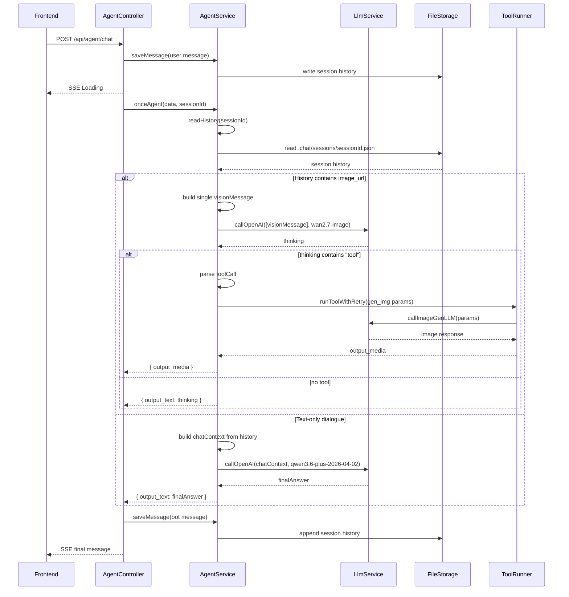

# handleChat 时序图

下面的时序图展示了 `handleChat()` 的调用链路，包括普通文本对话与图片对话两个分支。

## 说明

- `AgentController.handleChat()` 是入口，负责接收请求、写入用户消息、发送 SSE loading、调用 `onceAgent()`、保存机器人消息、返回最终结果。
- `AgentService.onceAgent()` 读取历史并判断是否进入图片对话分支。
- 图片分支只发送一个 `visionMessage` 给 `wan2.7-image`，并在返回中检查是否需要调用 `gen_img` 工具。
- 普通文字分支使用最近 8 条历史消息，调用 `qwen3.6-plus-2026-04-02`。
- `LlmService.callOpenAI()` 负责调用 OpenAI SDK 并兼容返回的 `message.content` 结构。
- 如果图片工具返回 `output_media`，最终会下载图片并将图像附加到历史消息中。
